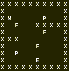
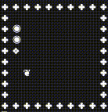

# Console game [[OpenAI Gym](https://gym.openai.com/)]

[](https://dev.azure.com/KennethTang/github/_build/latest?definitionId=10&branchName=master)
[](https://dev.azure.com/KennethTang/github/_build/latest?definitionId=10&branchName=master)

|Ubuntu|Windows|MacOS|
|:--:|:--:|:--:|
|[](https://dev.azure.com/KennethTang/github/_build/latest?definitionId=10&branchName=master)|[](https://dev.azure.com/KennethTang/github/_build/latest?definitionId=10&branchName=master)|[](https://dev.azure.com/KennethTang/github/_build/latest?definitionId=10&branchName=master)|

## Mouse walking maze


這是一個簡單的老鼠走迷宮 [OpenAI Gym](https://gym.openai.com/) 環境，這個環境包含了 3 種子環境:

1. 發生無效動作時，不進行任何的獎勵給予或動作屏蔽 ([BaseEnv](./env/MouseWalkingMaze/base_env.py))
1. 發生無效動作時，給予一個負獎勵 ([NegativeRewardEnv](./env/MouseWalkingMaze/negative_reward_env.py))
1. 發生無效動作時，使用動作遮罩屏蔽代理人的動作選擇 ([ActionMaskEnv](./env/MouseWalkingMaze/action_mask_env.py))

目的是為了驗證代理人受到環境的限制而出現大量的無效動作時，採用上述 ３ 種方法其效果如何。

### [地圖資訊定義](./env/MouseWalkingMaze/map_define.py)
```
道路 = ' '
牆壁 = 'X'
出口 = 'E'
老鼠 = 'M'
食物 = 'F'
毒藥 = 'P'
```

<br>

## Snake


這是一個簡單的貪食蛇 [OpenAI Gym](https://gym.openai.com/) 環境，這個環境包含了 ２ 種子環境:

1. 發生無效動作時，不進行任何的獎勵給予或動作屏蔽 ([BaseEnv](./env/Snake/base_env.py))
1. 發生無效動作時，使用動作遮罩屏蔽代理人的動作選擇 ([ActionMaskEnv](./env/Snake/action_mask_env.py))

目的是為了驗證代理人受到環境的限制而出現大量的無效動作時，採用上述 2 種方法其效果如何。

⚠️⚠️⚠️ Snake 環境僅支援: Windows, Mac

### [地圖資訊定義](./env/Snake/map_define.py)
```
道路 = ' '
牆壁 = '✤'
蛇的頭 = '❖'
蛇的身體 = '◉'
食物 = '❦'
```

<br/>

## 如何使用

**1.** Clone `stable-baselines` 支援 `Action maske` 的版本
```
git clone https://github.com/NTUT-SELab/stable-baselines
cd stable-baselines
git checkout neglogp+entropy
cd ..
```
**2.** Clone 這個 Repositorie
```
git clone https://github.com/NTUT-SELab/mouse-walking-maze.gym
cd mouse-walking-maze.gym
```

**3.** 執行範例
- 使用 Docker

> SB_PATH是 `stable-baselines` 專案存放的路徑
> ```
> SB_PATH=/homes/user/stable-baselines/ ./scripts/run_docker_gpu.sh python ./examples/Snake/PPO2/run_action_mask.py MlpPolicy
> ```
> 使用GPU請參考: [Build and run Docker containers leveraging NVIDIA GPUs](https://github.com/NVIDIA/nvidia-docker)

- 直接執行
> MlpPolicy 是策略神經網路，請參考: [Policy Networks](https://stable-baselines.readthedocs.io/en/master/modules/policies.html)
>> 由於我們設計的遊戲狀態內容太小，導致預設的CNN策略神經網路不能捲機。因此我們自訂了較小的卷積層，請參考: [自定義策略神經網路](./examples/utils/custom_policy.py)
> ```
> python3 ./examples/Snake/PPO2/run_action_mask.py MlpPolicy
> ```
